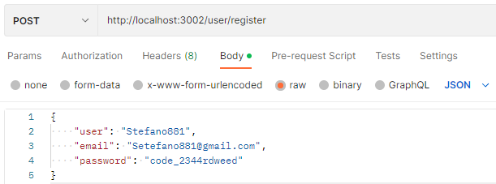
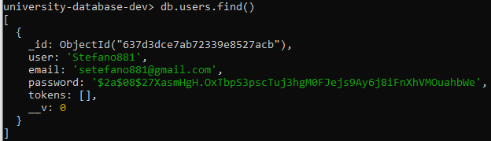
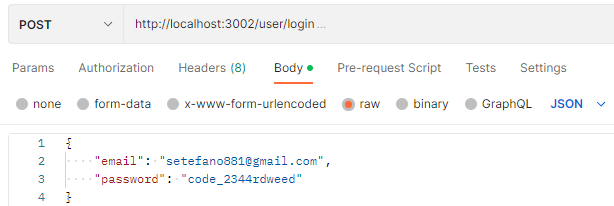

# How to start the server
Before start the server locally or run the test, it's fundamental install MongoDB.  
To start the server (in this case on port 3002) run the command: ```npm start```.  
To execute the tests run the command: ```npm test```.  
To execute the server in dev mode: ```npm run dev```.  

# Overview of the project
The project is structurated in 2 main parts: 
- the web server implemented in NodeJS.
- the NoSQL database (MongoDB)  

The web server exposes REST api that allow to create a new user, and for every user is possible to associate one or more universities. Once the  
user is created is possible to do the login with the credential (username and password).  
Let's do a pratical example using Postman:

1. start the server
2. Sign in of a new user  
     
   In this post request is passed in the body the username, email and password of the new user, the email has to be formatte as a valid
   email, and the password has to have at least 7 characters otherwise and error is returned.
   Once the post request is done a new user is stored in the collections "users" in the MongoDB database, let's see it:  
     
   As we can see in the db is not stored the user with the password specified in the request, the value of the property "password" that we see is  
   the encrypted version of the password.  
   Furthermore we can see that the property token was added, this property will be useful in the next steps.

3. Login of the user  
     
   In this post request are passed the credential of the user so email and password, if these credentials are correct an new token is added in  
   the property token of the user stored in the db, let's see it:  
   
